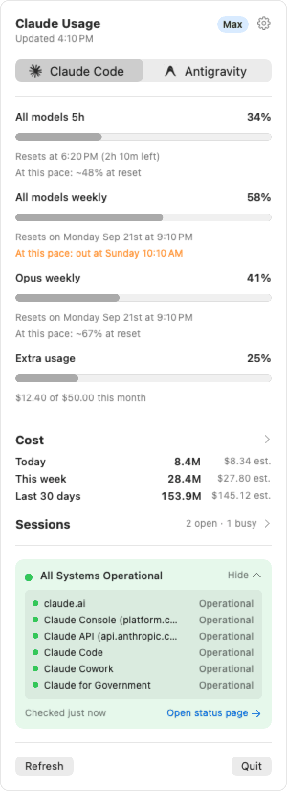
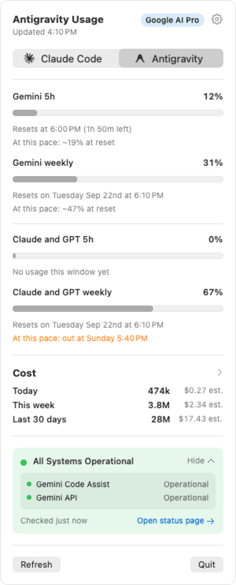
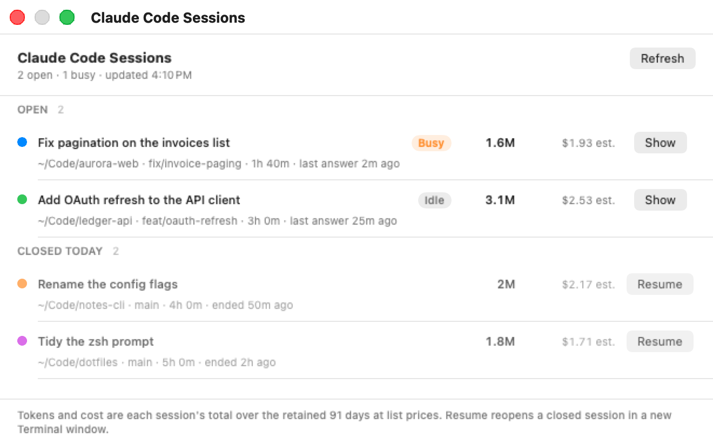
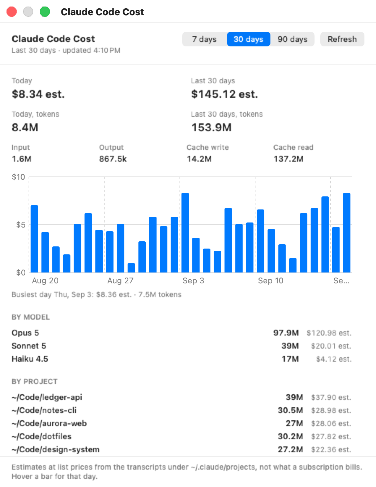
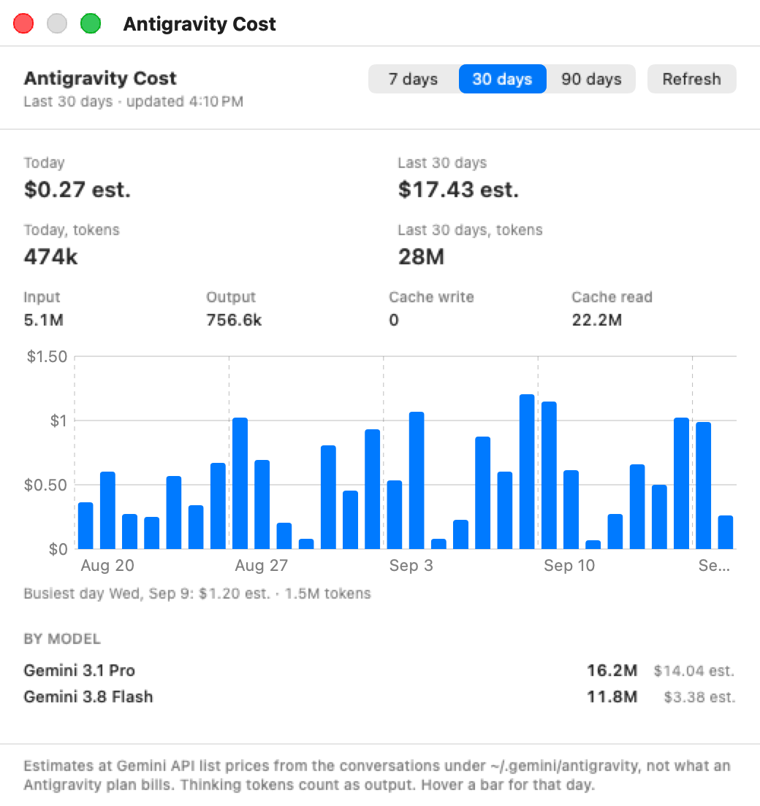

# AI Usage Bar

[](https://github.com/DragonF1/AIUsageBar/actions/workflows/ci.yml)

macOS menu bar app showing your Claude subscription usage (5-hour session, weekly, per-model) with colored progress bars, plus the Anthropic status page incident banner. A second tab shows Google Antigravity's four limits the same way: weekly and five-hour for the Gemini models, weekly and five-hour for the Claude and GPT models, with the same kind of banner fed by Google Cloud's status dashboard. Refreshes every 5 minutes. The menu bar follows the selected tab: `5h% / weekly%` next to the Claude starburst, or the Gemini group's `5h% / weekly%` next to the Antigravity arch, with the icon colored by whichever bar is closer to its cap (or by the window you pick). Both tabs also count the tokens the product spent on this Mac (today, this week, last 30 days, with a list-price estimate) from its local files, and open a cost window with a daily chart over 7, 30 or 90 days and a split by model and, for Claude Code, by project folder. Every row carries a pace forecast, and macOS notifications warn when a window passes a threshold, runs out, is on a pace to run out, or resets after a warning.

No cookie scraping. It reads the OAuth token Claude Code already keeps in your Keychain and asks Anthropic's usage endpoint directly, the same data `claude /usage` shows.

## Screenshots

The menu bar item on either tab, and the popover behind it:

<p>
<picture>
  <source media="(prefers-color-scheme: dark)" srcset="docs/screenshots/menubar-claude-dark.png">
  
</picture>
<picture>
  <source media="(prefers-color-scheme: dark)" srcset="docs/screenshots/menubar-antigravity-dark.png">
  
</picture>
</p>
<p>
<picture>
  <source media="(prefers-color-scheme: dark)" srcset="docs/screenshots/popover-claude-dark.png">
  
</picture>
<picture>
  <source media="(prefers-color-scheme: dark)" srcset="docs/screenshots/popover-antigravity-dark.png">
  
</picture>
</p>

The sessions window and the two cost windows:

<p>
<picture>
  <source media="(prefers-color-scheme: dark)" srcset="docs/screenshots/sessions-dark.png">
  
</picture>
</p>
<p>
<picture>
  <source media="(prefers-color-scheme: dark)" srcset="docs/screenshots/cost-claude-dark.png">
  
</picture>
<picture>
  <source media="(prefers-color-scheme: dark)" srcset="docs/screenshots/cost-antigravity-dark.png">
  
</picture>
</p>

The numbers in these pictures are made up. `scripts/render-screenshots.sh` draws them from a fixture through the app's own views (`AIUsageBar --render <dir> --appearance light|dark`), so they track the code without anyone's plan, spend or folders in them.

## Requirements

- macOS 14+
- Claude Code installed and signed in with a Pro/Max subscription (`claude` then `/login`). API-key logins have no usage windows to show.
- Optional: Antigravity (`/Applications/Antigravity.app`) signed in with a Google account, or the Antigravity IDE running. Without either the Antigravity tab shows "No Antigravity login found".
- Xcode command line tools (to build)

Everything runs locally. The app talks to exactly five hosts: `api.anthropic.com` and `platform.claude.com` for Claude usage, `status.claude.com` for Anthropic incidents, Google's `oauth2.googleapis.com` / `*cloudcode-pa.googleapis.com` for Antigravity, and `status.cloud.google.com` for Google Cloud incidents; plus, when its own Antigravity token is unusable, the Antigravity IDE's language server on `127.0.0.1`. No telemetry, no accounts, nothing of yours leaves the machine except the tokens those calls need.

## Build and install

```sh
git clone https://github.com/DragonF1/AIUsageBar.git
cd AIUsageBar
scripts/build-app.sh --install
```

Builds `dist/AIUsageBar.app`, copies it to `/Applications`, launches it. "Start at login" is on by default (the popover's gear turns it off) and registers the app at whatever path it runs from; `--install` moves that login item from `dist/` to `/Applications`. The first launch asks for notification permission; decline it and the notification switch does nothing.

There is no Apple developer certificate behind the build, which is why there is no prebuilt download: a downloaded app without one is refused by Gatekeeper, one you built yourself is not. Out of the box the build is ad-hoc signed, and an ad-hoc signature changes with every build, so macOS treats each rebuild as a new app: any privacy permission it asked for (Removable Volumes, when Antigravity's files live on an external disk) is asked again. Run `scripts/make-signing-identity.sh` once to put a self-signed "AI Usage Bar Dev" identity in your login keychain; `scripts/build-app.sh` signs with it from then on (or with whatever `CODESIGN_IDENTITY` names), the app's designated requirement stays the same across builds, and a grant given once is kept. The identity is untrusted as far as `security find-identity -v` is concerned, which is fine for codesign and changes nothing about Gatekeeper.

`swift test` runs the unit tests (parsers, refresh flow, session loader, resume command, pace forecast, notification rules), and the CI workflow in `.github/workflows/ci.yml` runs them plus `scripts/build-app.sh` on a macOS runner. The app icon is drawn by `scripts/make-icon.py` (needs Pillow); the checked-in `Sources/AIUsageBar/Resources/AppIcon.icns` is its output. The README screenshots come from `scripts/render-screenshots.sh`: it builds the app and runs it with `--render`, which shows each surface with fixture numbers, captures it off the view (no Screen Recording grant) and quits, once per appearance; `scripts/shrink-png.py` then palette-quantises the PNGs when Pillow and NumPy are installed. The windows flash up for a few seconds while it runs.

## Configuration

Optional. The app reads `~/.config/aiusagebar/` and never writes there.

- `config.json` has three keys. `{"claude": {"refresh": true}}` lets the app start `claude` in the background when the stored token has expired, so Claude Code refreshes it (see "How it works"). `{"notifications": {"thresholds": [80, 95]}}` sets the percentages the notifications warn at (default 80 and 95; an empty list keeps only the used-up, pace and reset notices). `"resume"` changes what "Resume" in the sessions window runs. Default is a new Terminal window with `claude --resume <id>` in the session's folder. To go through your own launcher script instead (say one that adds `--permission-mode` or `--effort` flags):

  ```json
  {"resume": {"launcher": "~/bin/claude-launch.sh", "env_file": "~/bin/claude-launch.env"}}
  ```

  The script receives `CLAUDE_RESUME` (session id) and `CLAUDE_LAUNCH_DIR` (its folder) in the environment, plus every `KEY=value` line of `env_file`, and is expected to open the terminal window itself. Paths may start with `~`.
- `antigravity-client.json` lets the app refresh an expired Antigravity token itself. It holds the OAuth client Antigravity signs in with, which this repository does not ship:

  ```json
  {"client_id": "...apps.googleusercontent.com", "client_secret": "..."}
  ```

  Without the file the Antigravity tab only reads the token Antigravity keeps fresh, and says so when that token has expired.

## Menu

Under the popover's header, a segmented switch with each product's mark next to its name picks the tab (Claude Code or Antigravity); the choice is remembered and the menu bar item follows it. The gear at the top right holds the switches; right-clicking the menu bar item shows the same ones plus Refresh and Quit. They live in the app's own defaults, not in `config.json`. Both menus end with a link that follows the selected tab: "Usage on claude.ai" opens claude.ai's own usage page in the browser; "Plan on Google One" opens the Google One page for the AI plan, since Antigravity shows its quota only inside the app.

- Refresh now (⌘R).
- Notifications: on by default. One notification per window per poll, and each kind once per cycle: "at 82%" when a threshold is first passed (a jump past two thresholds posts once, for the higher one), "used up" at 100%, "running out" when the pace forecast lands before the reset, and "reset" when a window that got any of those warnings starts over. Turning the switch off keeps tracking silently, so nothing that happened while it was off is replayed when it comes back on.
- Start at login: on by default.
- Extra usage credits: on by default. Shows the month's extra-usage credits as one more row under the Claude bars ("Extra usage", "$12.40 of $50.00 this month", bar at the percent spent) and warns on them at the same thresholds. The row only appears for an account that has extra usage enabled on claude.ai; the credits are account-wide, not per model, and the endpoint gives no reset date, so this row never has a pace forecast. Off hides the row and stops the warnings.
- Menu bar tint: Auto (the 5-hour window, or the weekly one once it reaches 85%), 5-hour window, or Weekly window. This picks which window colors the icon; the numbers next to it do not change.

## Pace forecast

Each usage row ends with "At this pace: ~62% at reset" or, in orange, "At this pace: out at 3:40 PM". The line is a straight line through the recent polls of the current cycle (the last hour for 5-hour windows, the last day for weekly ones) carried to the reset. It needs ten minutes of samples for a 5-hour window and two hours for a weekly one, and goes quiet when usage is flat, the window is used up, or the reset has passed. A cycle starts over when the percentage drops by more than five points or the reset time moves by more than a minute. Samples and the notification state are kept in `~/Library/Application Support/AIUsageBar/quota.json` so a relaunch neither loses the forecast nor repeats a notification.

## How it works

- Token: Keychain item `Claude Code-credentials` (falls back to `~/.claude/.credentials.json`). Read through `/usr/bin/security`, the same path Claude Code uses, so no Keychain access prompt. Nothing in this app ever writes the credential.
- Data: `GET https://api.anthropic.com/api/oauth/usage` with `Authorization: Bearer` and `anthropic-beta: oauth-2025-04-20`. Rows come from the `limits` array (session, weekly all models, weekly per model) plus the `extra_usage` credits when the account has them and the switch is on.
- Token refresh: off by default. When the stored access token has expired the app says so and keeps showing the last numbers until Claude Code refreshes it (which it does whenever `claude` runs). With `{"claude": {"refresh": true}}` in `config.json` the app does the running for you: it starts the real `claude` on a hidden pseudo-terminal, in an empty folder of its own (`~/Library/Application Support/AIUsageBar/claude-probe`), waits for Claude Code to refresh its own credential, then reads the Keychain again. The session gets no tools, no MCP servers, no hooks, no Remote Control and the classic renderer (a `--settings` overlay for that launch only; your saved settings stay), and is never given a prompt. The first run stops at Claude Code's folder-trust question; if the credential has not moved after 7 s the probe answers "yes" for its empty folder and the session starts. It is then closed the way you would close it (Esc, Ctrl-C twice, `/exit`), so Claude Code's own exit hooks run, and the registry and transcript files of that empty session are removed. Guards: re-reads the Keychain first, at most one attempt per minute, gives up after 20 s, and defers to a `claude` you already have running for the first 3 minutes after expiry. `claude-probe/last-run.txt` records what the last run saw and how it ended. The probe never shows in the sessions window.
- Status: polls `status.claude.com/api/v2/summary.json` every 5 minutes and shows the page's state above the usage rows: the overall line, "N active incidents" and the affected products (those three stay visible when the card is folded), one row per product with its own coloured dot, each open incident with its latest update and the products it names, and a link to the status page; "All Systems Operational" when clear. Every poll after the first is a conditional request (`If-None-Match` with the ETag the page sent), so an unchanged page answers 304 with no body and the last summary stays.
- Rate limits: honors `Retry-After` on 429, otherwise backs off 15 minutes, and keeps showing the last good numbers greyed out.

## Claude Code cost

A "Cost" section under the usage bars on the Claude tab: three single-line rows, "Today", "This week" and "Last 30 days", each with the token count and an estimated cost on the right. Hover a row for the breakdown by bucket and the window boundary. The "Cost" header opens the cost window (below).

- What is counted: every assistant response in the Claude Code transcripts under `~/.claude/projects` (the `*.jsonl` session files, including subagent and workflow transcripts nested inside them). A response's `usage` has four buckets, input, output, cache write and cache read, and the row shows their sum. One response is written as several lines (one per content block, same `message.id`) and a resumed or forked session copies lines into a new file, so responses are deduplicated on message id across all files and the copy with the larger total wins. Synthetic lines and lines without usage are skipped. Nothing leaves the machine.
- Windows: "Today" is since local midnight. "This week" is the 7 days ending at your weekly limit's reset time when the usage endpoint has reported one (the tooltip reads "Since Thu 6:00 AM", so the row lines up with the weekly bar above it); until then it is a rolling 7 days and the tooltip says so. "Last 30 days" is 30 calendar days, today included, the cost window's default range.
- Pricing (USD per million tokens, list prices, no discounts):

  | Model | Input | Output | Cache read |
  |---|---|---|---|
  | claude-fable-5-1 | $10 | $50 | $0.25 |
  | claude-fable-5 | $10 | $50 | $1 |
  | claude-opus-5 / 4-8 / 4-7 / 4-6 | $5 | $25 | $0.50 |
  | claude-sonnet-5 | $2 | $10 | $0.20 |
  | claude-sonnet-4-6 | $3 | $15 | $0.30 |
  | claude-haiku-4-5 | $1 | $5 | $0.10 |

  Cache write is 1.25x the input price for the 5 minute TTL and 2x for the 1 hour TTL. Cache read is 0.1x the input price unless the table says otherwise. Model ids are matched by prefix, so a date suffix or a `[1m]` context marker does not matter.
- Costs are estimates: what the same tokens would cost on the API at list price, which is not what a subscription bills. Tokens from a model the table does not know are still counted, but the cost is shown as a floor ("≥ $12.34 est.") and the tooltip says how many tokens went unpriced.
- Cache: byte offsets per transcript and the deduplicated records live in `~/Library/Application Support/AIUsageBar/tokens.json`, so each 5 minute poll (and each popover open after a minute) reads only the bytes appended since the last one. Records older than 91 days are dropped (one day past the cost window's longest range, so the oldest bar stays complete across the midnight it ages out).
- First launch: scans the last 91 days of transcripts once, off the main thread; a busy quarter of transcripts can take a few minutes. The rows show "Scanning transcripts…" until it finishes. To force a full rescan, quit the app, delete `tokens.json` and relaunch (the running app keeps the cache in memory and would write it back).

## Cost window

The "Cost" header on either tab opens a separate window for that product with the last 7, 30 or 90 days (a segmented picker in the header, remembered between opens, 30 by default): today's cost and tokens, the range's cost and tokens, the range's tokens by kind (input, output, cache write, cache read; hover one for its share), a bar per calendar day (hover a bar for that day's cost and tokens; the line under the chart otherwise names the busiest day), the same days split by model, costliest first, and on the Claude Code window the same days split by project, meaning the folder each session ran in (the first eight, then "Show all"; hover a row for the full path). Every figure is the list-price estimate the popover rows use. Esc or ⌘W closes it; it refreshes every 15 s while open. The Claude Code and Antigravity windows are separate and remember their own positions.

## Sessions window

The "Sessions" button under the cost rows opens a separate window listing every Claude Code session: the ones running now (busy or idle), then the ones that answered today but whose process is gone. Each row shows the session's colour, its title, its tokens and estimated cost over the retained 91 days, the folder it runs in, its branch, how long it has been going and when it last answered. Hover a row for the session id, PID, full path, last prompt and the token breakdown. Esc or ⌘W closes it; it refreshes every 15 s while open.

- Open sessions come from Claude Code's registry, `~/.claude/sessions/<pid>.json` (id, folder, busy/idle, a `/rename` name), kept only when the PID is still alive. Titles, colours, last prompts and branches come from the bookkeeping lines Claude Code writes into each transcript (`ai-title`, `agent-color`, `last-prompt`). Cost is the same list-price estimate as the cost rows; the API does not report a session's share of the 5-hour limit.
- "Show" (open session) brings that session's Terminal window to the front: `ps` gives the PID's tty, and Terminal is asked over AppleScript for the tab on it. Sessions running in another terminal app get a "No Terminal.app window" notice. macOS asks once to let AI Usage Bar control Terminal.
- "Resume" (closed session) reopens it exactly like `/resume`: Terminal gets a new window that changes into the session's folder (transcripts live per folder) and runs `claude --resume <id>` in a login shell, so `claude` resolves through your own PATH. With a `config.json` launcher (see Configuration) the app runs that script instead, with `CLAUDE_RESUME` and `CLAUDE_LAUNCH_DIR` in its environment. No colour is passed either way: Claude Code reads the session's own colour back from the transcript, so the session keeps the colour it had. A session whose folder is gone cannot be resumed and says so. Double-clicking a row does the same as its button. On success the sessions window closes.

## Antigravity tab

- Token: Antigravity's standalone app keeps its Google OAuth token in `~/.gemini/jetski-standalone-oauth-token`. This app only reads that file, never writes it. When the access token in it has expired and `~/.config/aiusagebar/antigravity-client.json` exists, the app runs the refresh-token flow against `oauth2.googleapis.com/token` with that client and caches only the new access token in `~/Library/Application Support/AIUsageBar/antigravity-token.json` (mode 0600, at most one refresh per minute). Without the file it waits for Antigravity to refresh the token itself. Sign back in inside Antigravity if the tab says the login expired.
- Fallback: when the token path fails for any reason but a rate limit (no token file, login expired with no refresh client, token rejected twice, backend error), the app asks the running Antigravity IDE instead, the way CodexBar does. The IDE's language server (`language_server_macos_arm` inside the app bundle) answers its own quota panel's RPCs over HTTPS on a localhost port, guarded by the CSRF token on its command line; both are readable through `ps -axo pid=,command=` and `lsof -nP -iTCP -sTCP:LISTEN -a -p <pid>` by any process of the same user. The app POSTs `https://127.0.0.1:<port>/exa.language_server_pb.LanguageServerService/RetrieveUserQuotaSummary` (body `{"forceRefresh":true}`, header `X-Codeium-Csrf-Token`) and `GetUserStatus` for the plan name, accepting the server's self-signed certificate for `127.0.0.1` only, trying each listening port of each server until one answers. The answer is the same payload as the backend's, and the server's `--cloud_code_endpoint` is remembered as the backend, so the next poll that does get a token asks the same one. The token is never logged or stored, nothing is written to Antigravity, and when the IDE is not running the token path's own message stays on the tab, since that is what says what to fix.
- Data: `POST <backend>/v1internal:retrieveUserQuotaSummary` with body `{}`, the same call behind Antigravity's quota panel. It returns `groups[]` (Gemini Models; Claude and GPT models), each with `buckets[]` for the `weekly` and `5h` windows carrying `remainingFraction`, `resetTime` and Google's own "will fully refresh in 2 days, 17 hours" sentence. Shown as percent used, like the Claude rows. A bucket that arrives without `remainingFraction` counts as fully used: Google's JSON omits zero-valued fields.
- Backend: Google runs two of them and meters quota separately on each. Antigravity itself asks `cloudcode-pa.googleapis.com/v1internal:loadCodeAssist` first and then talks to `cloudcode-pa.googleapis.com` when the account is under GCP terms of service (`paidTier.usesGcpTos`), otherwise to `daily-cloudcode-pa.googleapis.com`, which is where a consumer Google account lands. The app follows the same rule, so its rows match the panel; asking the other backend returns a mostly untouched quota. If the account lookup fails on a poll, the app keeps asking the backend of the last good poll (remembered in the cache), or the daily one when the cache has no backend yet (fresh install or a cache from an older build).
- Under each row: the reset time, worded like the Claude rows. Google's own sentence ("You have used some of your weekly limit, it will fully refresh in 2 days, 18 hours.") is received but not shown. A 5-hour row nobody has touched reads "No usage this window yet", because Google reports its reset as five hours from whenever you ask.
- Plan badge: the same `loadCodeAssist` answer carries the tier name ("Google AI Pro"). Failure there only costs the badge, which keeps its last name; a 429 there backs off like one on the quota call.
- Same 5 minute poll, same 429/backoff handling and greyed-out cache as the Claude tab.
- Status: Antigravity has no status page of its own, so the card under the cost rows polls Google Cloud Service Health (`status.cloud.google.com/incidents.json`, every 5 minutes) and keeps the incidents that are still open on the two products Antigravity runs on: Gemini Code Assist (the `cloudcode-pa` backend the app calls) and the Gemini API (listed there as "Vertex Gemini API"). Same layout as the Claude card: one row per product, the open incidents with their latest update, a link to the dashboard; "All Systems Operational" when nothing is open. Its Hide/Show fold is remembered separately from the Claude card's. The feed is 170 KB of every recent incident, so every poll after the first sends `If-Modified-Since` with the date the feed last gave and a 304 keeps the last summary without downloading or decoding it again.
- Diagnostics: each poll writes one line to the unified log, `fetch ok (timer) via https://daily-cloudcode-pa.googleapis.com: gemini-weekly=0.4851 gemini-5h=1.0000 3p-weekly=0.6651 3p-5h=1.0000` (or `fetch ok (timer) via Antigravity pid 96528 port 62185 (https://cloudcode-pa.googleapis.com), token path failed: ...` when the IDE answered), and each failure one `fetch failed (...)` line, with a `local probe failed: ...` info line before it when the IDE was tried. Read them with

  ```sh
  log show --info --predicate 'subsystem == "io.github.dragonf1.aiusagebar"' --last 1h
  ```

  or watch live with `log stream --level info --predicate 'subsystem == "io.github.dragonf1.aiusagebar"'`. Compare the fractions with Antigravity's quota panel: the app shows `100 - fraction * 100` as percent used.

## Antigravity cost

The same "Cost" section as the Claude tab, under the four limit rows: "Today", "This week" and "Last 30 days" with the token count and an estimated cost, the same tooltips, and a "Cost" header that opens Antigravity's own cost window. Nothing leaves the Mac: the numbers come from the conversation databases Antigravity keeps locally.

- Source: `~/.gemini/antigravity/conversations/<id>.db` (and `~/.gemini/antigravity-cli/conversations` when the CLI has made one), one SQLite database per conversation, opened read-only. The `gen_metadata` table holds one protobuf blob per model response with the counts inside: system prompt and new input (summed as input), cache reads, output and thinking (summed as output, which is how Gemini bills thinking). Antigravity reports no cache writes, so that bucket is always 0. Field numbers are Antigravity's own, read the way its databases lay them out; they are not published, so a future Antigravity could move them.
- Time: a response's row carries no timestamp. Its `last_step_index` tag names the conversation step it ended on, and that step's row in the `steps` table has the time, which is what dates the record. A response without the tag takes the first timestamp of its turn; one without either the database's modification time.
- Models: the model id the response was routed to ("gemini-3.8-flash", "gemini-3.1-pro-low", "claude-sonnet-4-6" when Antigravity used Claude). A few rows carry only an internal enum ("MODEL_PLACEHOLDER_M36"); the scanner maps those to the model id it has seen alongside the same enum, and shows the enum as the model, unpriced, when it has never seen the pair.
- Prices: Gemini API paid-tier list prices (cache read at 10% of input), so a Gemini 3.8 Flash response is 0.75 USD per million input tokens and 3.75 per million output; Pro and the aliases Antigravity uses for its default Pro model ("gemini-pro-default", "gemini-pro-agent") are priced as Gemini 3.1 Pro. Responses Antigravity routed to Claude use the Claude rate for that model. These are estimates of what the same tokens would cost on the API, not what an Antigravity plan bills; the plan's quota is what the four limit rows show.
- Windows: the same as the Claude tab, with "This week" aligned to the Gemini group's weekly reset once the quota call has reported one.
- Cache: the highest row read per database and the deduplicated records live in `~/Library/Application Support/AIUsageBar/antigravity-tokens.json`. A database is reopened only when its modification time (or its `-wal` sidecar's) has moved, and only the rows appended since the last read are decoded; a full first scan of a quarter of conversations takes a few seconds. Records older than 91 days are dropped. To force a full rescan, quit the app, delete `antigravity-tokens.json` and relaunch.
- No sessions window for Antigravity: its conversations are not Terminal processes, so there is nothing to show or resume.

## Caveats

- The usage and token endpoints are internal and undocumented; Anthropic and Google may change them. The same goes for Antigravity's conversation databases.
- "Started `claude` but the token stayed expired": with `claude.refresh` on, the probe ran and Claude Code did not write a fresh token in 20 s. Run `claude` yourself; it may want a fresh sign-in. `~/Library/Application Support/AIUsageBar/claude-probe/last-run.txt` shows the screen the probe saw.
- Not affiliated with Anthropic or Google.

## License

MIT, see `LICENSE`.

## Tests

```sh
swift test
```

Two tests talk to the real programs on the Mac and are skipped unless asked for: `AIUSAGEBAR_LIVE_PROBE=1 swift test --filter LiveProbeTests` starts and stops `claude` on a pty (it answers the trust question for the app's own probe folder only when `AIUSAGEBAR_LIVE_PROBE_TRUST=accept`), and `AIUSAGEBAR_LIVE_ANTIGRAVITY=1 swift test --filter LiveAntigravityProbeTests` asks the running Antigravity IDE for its quota summary.
